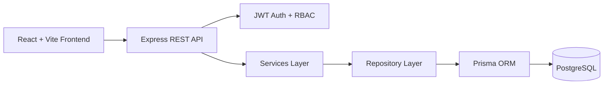
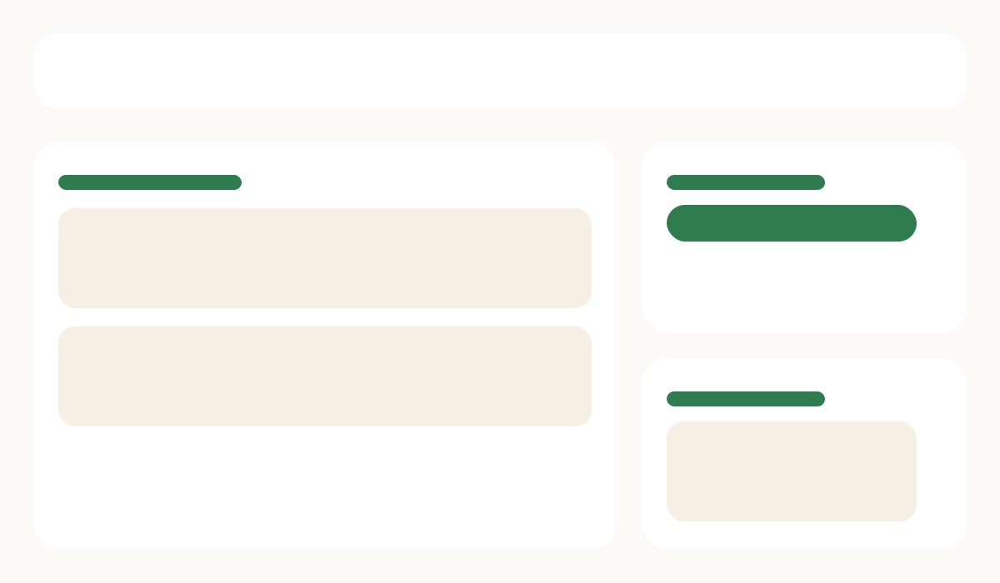

# Sehat Setu

Sehat Setu is a full-stack rural healthcare access platform built as a portfolio project to demonstrate production-quality engineering practices for a Thoughtworks-style application. It connects Patients, ASHA workers, and Doctors in a shared workflow for appointments, home visits, symptom tracking, escalation, and treatment follow-up.

## Problem Statement

Rural healthcare delivery in India often breaks at the coordination layer. Patients may live far from clinics, ASHA workers collect field observations that are hard to escalate quickly, and doctors often receive incomplete history when cases finally reach them. Sehat Setu models that coordination gap directly:

- Patients can sign up, book appointments, review records, and submit symptom checks.
- ASHA workers can track assigned households, log visits with vitals, and escalate risky cases.
- Doctors can review escalation queues, inspect patient history, write prescriptions, and close cases.

## Architecture



## Project Structure

```text
.
|-- frontend/
|-- backend/
|-- docs/
|   |-- api.md
|   `-- screenshots/
`-- docker-compose.yml
```

## Dashboards

Patient dashboard:


ASHA dashboard:


Doctor dashboard:



## Tech Stack

- Frontend: React, Vite, React Router, Tailwind CSS, Context API, Axios
- Backend: Node.js, Express, layered architecture
- Database: PostgreSQL, Prisma ORM
- Authentication: JWT with role-based access control
- Testing: Jest, React Testing Library, Supertest
- Local dev: Docker Compose

## Tech Decisions And Tradeoffs

- JavaScript over TypeScript: faster scaffold for portfolio delivery, with runtime validation handled through Zod on the backend.
- Context API over Zustand: sufficient for auth and toast state without introducing another state abstraction.
- Prisma with PostgreSQL: provides a clean relational model and a seedable demo environment.
- Monorepo workspaces: keeps frontend and backend isolated while still sharing root scripts and formatting.
- Swagger was skipped in favor of a lightweight markdown API contract in [docs/api.md](docs/api.md) to keep the implementation lean.

## Setup

### 1. Install dependencies

```bash
npm install
npm install -w backend
npm install -w frontend
```

### 2. Configure environment

```bash
cp backend/.env.example backend/.env
cp frontend/.env.example frontend/.env
```

### 3. Start PostgreSQL and run schema setup

With Docker Compose:

```bash
docker compose up -d postgres
```

Then run:

```bash
npm run prisma:generate -w backend
npx prisma db push --schema backend/prisma/schema.prisma
npm run seed -w backend
```

### 4. Start the app

```bash
npm run dev
```

Frontend: `http://localhost:5173`  
Backend: `http://localhost:4000`

## Seeded Demo Accounts

- Patient: `patient@sehatsetu.in` / `Password123!`
- ASHA: `asha@sehatsetu.in` / `Password123!`
- Doctor: `doctor@sehatsetu.in` / `Password123!`

## API Documentation

See [docs/api.md](docs/api.md).

## Deployment Readiness

- `docker-compose.yml` provisions PostgreSQL, frontend, and backend.
- Frontend and backend each include a `Dockerfile`.
- `.env.example` files are committed for both workspaces.
- Seed data makes the application demoable immediately after setup.

## Quality Notes

- Backend follows `routes -> controllers -> services -> repositories -> Prisma`.
- Role checks are enforced through JWT middleware and RBAC middleware.
- Backend request bodies are validated centrally with Zod middleware.
- Frontend uses feature-based folders with shared API, hooks, layout, and UI primitives.
